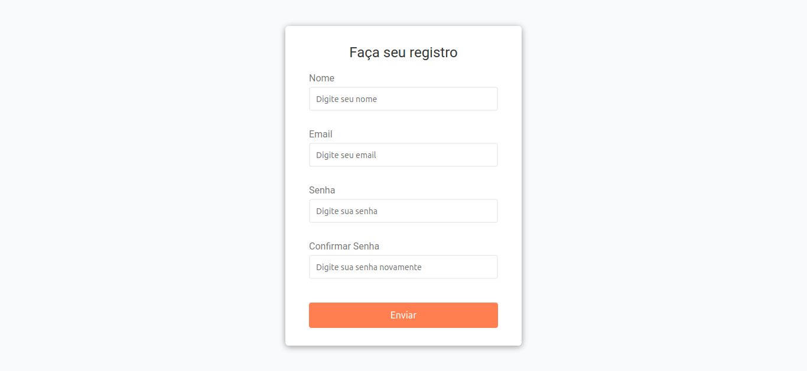

# form-validator-project

## Project

***EN:*** This is a simple client side form validation. It check required, length, email and password match.

***PT-BR:*** Uma simples validação de formulário no lado do cliente. Ela verifica a entrada necessária, tamanho, e-mail e senha.

### Specifications
- Create form UI
- Show error messages under specific inputs
- checkRequired() to accept array of inputs
- checkLength() to check min and max length
- checkEmail() to validate email with regex
- checkPasswordsMatch() to match confirm password
***

## Technologies

This project was developed with the following technologies:

- HTML
- CSS
- JavaScript
***
 
## Preview

***

## License

This project is under the MIT license.
